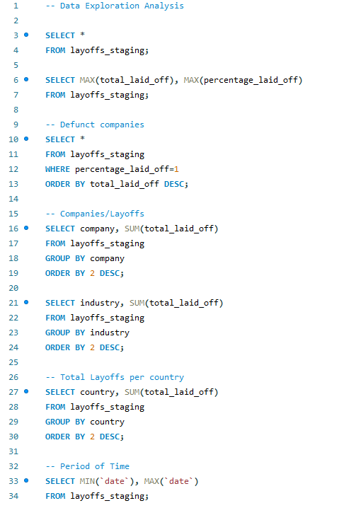
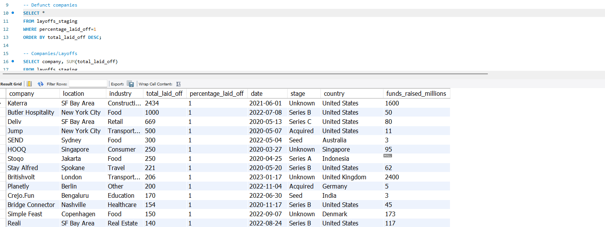
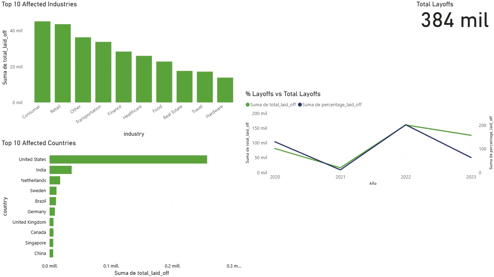

<h1 align="center">💼 Global Layoffs Analysis (2020–2023) — MySQL Project</h1>

  <b>Data Cleaning and Exploratory Analysis using SQL</b> 
  This project focuses on cleaning, transforming, and analyzing global layoffs data from <b>2020 to 2023</b> 
  using <a href="https://www.mysql.com/" target="_blank">MySQL</a>.  
  The repository includes SQL scripts that explore trends, patterns, and insights 
  related to workforce reductions worldwide during this period.

  

<h2>📊 Project Overview</h2>

  The dataset was cleaned and analyzed using structured SQL queries to ensure data accuracy and consistency.  
  Exploratory analysis was then performed to identify key patterns in layoffs across different <b>industries</b>, 
  <b>companies</b>, <b>countries</b>, and <b>time periods</b>.

<h2>⚙️ What's Included</h2>
<ul>
  <li><code>World_Laidoffs_2020-2023_Data-Cleaning.sql</code> — Scripts for removing duplicates, handling nulls, and standardizing formats.</li>
  <li><code>World_Laidoffs_2020-2023_Data-Exploration-Analysis.sql</code> — Queries to explore layoffs by country, industry, and company size.</li>
</ul>

<h2>💡 Key Insights</h2>
<ul>
  <li>Layoff peaks correspond to global economic downturns and tech sector contractions.</li>
  <li>Top affected regions and industries identified through aggregation and filtering queries.</li>
  <li>Trend analysis highlights recovery patterns post-2022 in certain markets.</li>
</ul>

<h2>📁 Data Source</h2>

  The dataset used in this project can be accessed from the following link: 
  <a href="https://github.com/AlexTheAnalyst/MySQL-YouTube-Series/blob/main/layoffs.csv" target="_blank"><b>🌐 Global Layoffs Dataset (Kaggle)</b></a>

<h2>🧭 How to Use</h2>
<ol>
  <li>Clone the repository and open the SQL files in your preferred MySQL environment (Workbench, VSCode, etc.).</li>
  <li>Import the dataset into a MySQL database.</li>
  <li>Run the <code>World_Laidoffs_2020-2023_Data-Cleaning.sql</code> script to prepare the data.</li>
  <li>Use the analysis scripts to explore trends and generate insights.</li>
</ol>

<h2>📸 EXTRA Dashboard Screenshot</h2>

  

  

<h2>🧠 Notes</h2>

  This project demonstrates the use of SQL for end-to-end data analysis — from cleaning to exploration and trend discovery.  
  It serves as a practical example of real-world data management and insight generation using MySQL.

